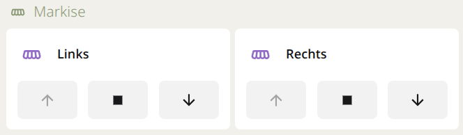

# WMS WebControl (Basic) – Home Assistant Integration

---

> [!IMPORTANT]
> This integration talks to the old Warema WMS WebControl via XML protocol. It does not work with the Warema WMS WebControl Pro.

---

This custom component enables local control of Warema awnings (with and without valance) via the classic **Warema WMS WebControl** (without "Pro") in Home Assistant. Since the WMS WebControl does not offer an official API, this integration uses the internal XML protocols, which are also used by the device's web interface, to send commands and query the status.

## Features

* **No YAML required**: The entire setup is performed conveniently and efficiently via the Home Assistant user interface (Config Flow).
* **Auto-Discovery**: You only need to enter the IP address. The integration automatically scans the web control for all rooms and channels and adopts the original device names!
* **Full Control**: Supports opening, closing, and stopping while moving, as well as moving to a precise percentage position.
* **100% Local**: All commands are sent directly to the web control within your local network. No cloud required!
* **Real-time Feedback**: Retrieves fresh data (wake-up command) before each status update, ensuring the position in Home Assistant is always accurate.

## Requirements

* A working **Warema WMS Webcontrol** (the older version, often implemented as a small black box).
* The IP address of the WMS Webcontrol must be known and ideally assigned statically in the router.

## Installation

The easiest method is installation via [HACS](https://hacs.xyz/) (Home Assistant Community Store).

1. Open **HACS** in Home Assistant.
2. Click on **Integrations**.
3. Click the three dots (`...`) in the upper right corner and select **Custom Repositories**.
4. Paste the URL of this repository: `https://github.com/moltke69/ha-wms-webcontrol`
5. Select **Integration** as the category and click *Add*.
6. Now search for *Warema WMS Webcontrol* in HACS, click on it, and select **Download**.
7. **Restart Home Assistant.**

*(Alternatively: Download the repository as a ZIP file and manually copy the `custom_components/warema_webcontrol` folder to your Home Assistant directory.)*

## Configuration

After the integration is installed and Home Assistant has been restarted, setup is a breeze:

1. In Home Assistant, go to **Settings** -> **Integration**.
2. Click **Add Integration** in the bottom right corner.
3. Search for **Warema WMS Webcontrol** and select it.
4. Enter the **IP address** of your web control (e.g., `192.168.1.50`).
5. Click *Submit*.

Sit back! The integration will now scan all rooms and automatically add your awnings as "covers" to your Home Assistant.

For each awning you have one entity for controlling the position and one entity to wave (the awning is going up and down shortly). If you have a valance, you'll get an additional entity to control it.

[]

## Troubleshooting

* **The awning only responds intermittently:** The system uses sequential numbers to authenticate commands. The integration handles this automatically. If commands are still being dropped, check if the web control has a stable Wi-Fi/LAN connection.
* **The position is incorrect:** Warema uses an internal logic of 0-200, while Home Assistant uses 0-100% (0% = closed/extended, 100% = open/retracted). The integration automatically converts this.

## WMS WebControl protocol (reverse engineering)

Since the Warema WMS WebControl does not have an official REST API, communication takes place via a hex string passed to `protocol.xml` as a GET parameter.
The base URL is always: `http://<IP>/protocol.xml?protocol=<HEX_STRING>`

*Note: 1 byte corresponds to 2 hex characters (e.g., `0A`).*

### 1. The General Header (The first 3 bytes)
Every transmitted string begins with the same 3-byte header, followed by a variable payload:

| Byte | Meaning | Explanation |
| :--- | :--- | :--- |
| **01** | Start byte | Always `90` (`COMMAND_CODE`). |
| **02** | Sequence counter | Sequential number from `01` to `FE` (1 to 254). At 254, the counter restarts at 1. `00` is invalid. Prevents replay attacks. |
| **03** | Payload length | The number of subsequent bytes (hexadecimal). |
| **04+**| Payload | The actual command (see below). |

---

### 2. Payload (Commands)

The first byte of the payload is the command ID (01-41).

#### Setup & management command (01-1D)

* 01 / 03: Create room / Query room
* 05 / 07 / 09: Change room name, change order, delete room
* 0B / 0D / 0F: Create, query, or delete channels (devices)
* 1B / 1D: Save infrastructure (i.e., all rooms and devices) to SD card or load from it

#### Operation & status (21-41)

* 21 (Channel operation): Movement command. (The response is 22)
* 23 (Position feedback): Wake-up command. (Response is 24)
* 25 (Wink): Makes the motor "wiggle" briefly (up/down) to identify it.
* 27 / 29: Query / change password
* 2B (Automatic mode): Enables or disables sun/wind automation for the device.
* 2D (Read thresholds): Reads the wind speed or brightness levels that trigger the automation.
* 2F (RTC): Sets the WebControl's internal clock (Real Time Clock).
* 31 (Polling): Our status query from the cache. (Response is 32).
* 3F / 41: Set thresholds or move to comfort positions.

#### A. Movement Command / Channel Operation (`21`)
Moves an awning or stops it.
**Example payload:** `21 00 01 03 64 FF FF FF` (Move room 0, channel 1 to 50%)

| Byte (in payload) | Meaning | Values |
| :--- | :--- | :--- |
| **01** | Command ID | `21` (Channel operation) |
| **02** | Room index | `00` to `13` (0 to 19) |
| **03** | Channel index | `00` to `09` (0 to 9) |
| **04** | Action | `01` = Stop, `03` = Move to position |
| **05** | Position (setpoint) | `00` (0%) to `C8` (100%). *Note: Warema uses 0.5% increments; therefore, 100% corresponds to the value 200 (0xC8). `FF` = ignore.* |
| **06** | Tilt / Angle | `-127°` to `+127°` (`00` to `FE`). `FF` = ignore. |
| **07** | Valance 1 position | `00` to `C8`. `FF` = ignore. |
| **08** | Valance 2 position | `00` to `C8`. `FF` = ignore. |

#### B. Wake-up / Request position feedback (`23`)
Wakes up the motor and forces it to transmit its current status to the WebControl.
**Example payload:** `23 00 01` (Wake-up for room 0, channel 1)

| Byte | Meaning | Values |
| :--- | :--- | :--- |
| **01** | Command ID | `23` |
| **02** | Room index | `00` to `13` |
| **03** | Channel index | `00` to `09` |

#### C. Polling / Read status (`31`)
Reads the XML-formatted data from the WebControl's buffer (after a wake-up). **Example payload:** `31 00 01 01` (Read position of room 0, channel 1)

| Byte | Meaning | Values |
| :--- | :--- | :--- |
| **01** | Command ID | `31` (Polling) |
| **02** | Room index | `00` to `13` |
| **03** | Channel index | `00` to `09` |
| **04** | Polling type | `01` = Query position |

### 3. Parsing the XML response
The WebControl responds to a polling command (`31`) with an XML string. The current position is contained within the `<position>` tag.
*Note:* The resolution range of 0 to 200 applies here as well. The value must be divided by 2 to obtain the actual percentage (0–100%). If the system reports the value `255`, the position is currently unknown (e.g., during a manual calibration run).

## Note on Code Development

The reverse engineering of the WMS protocol (intercepting the hex and XML strings) was performed manually. AI assistance (LLM) was used for the subsequent translation into a functional Home Assistant integration (Python, Config Flow, async logic).
The code was then thoroughly tested locally.

## Showing Your Appreciation

If you like this project, please give it a star on [GitHub](https://github.com/moltke69/ha_wms_webconfig) or consider becoming a [Sponsor](https://github.com/sponsors/moltke69).

---
*Disclaimer: This is an unofficial community project. It is not affiliated with WAREMA Renkhoff SE.*

